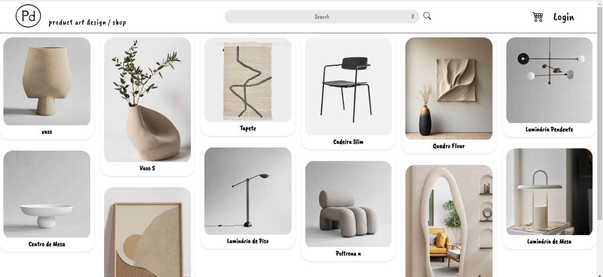

<h1 align="center"> Project-nodejs </h1>

  <a href="#-tecnologias">Tecnologias</a>&nbsp;&nbsp;&nbsp;|&nbsp;&nbsp;&nbsp;
  <a href="#-projeto">Projeto</a>&nbsp;&nbsp;&nbsp;|&nbsp;&nbsp;&nbsp;

 

  

## 🚀 Tecnologias

Esse projeto foi desenvolvido com as seguintes tecnologias:

- HTML e CSS
- Handlebars
- JavaScript
- NodeJS
- MySQL Workbench

## 💻 Projeto
No final do meu curso de Full-Stack, desenvolvi o projeto Product Art Design, um site que simula uma plataforma de e-commerce especializada na venda de produtos de design. O objetivo foi criar uma experiência imersiva e funcional, desde a navegação pela interface do usuário até a gestão de um carrinho de compras e administração de produtos, onde o usuário pode logar para simular a compra dos produtos ou para adicionar e manipular os produtos caso seja fornecedor. 

Este projeto foi uma oportunidade para aplicar os conhecimentos adquiridos ao longo do curso, tanto no front-end quanto no back-end, utilizando tecnologias como CSS, Handlebars, JavaScript, Node.js e bancos de dados. O foco principal foi garantir uma navegação fluida e intuitiva, além de implementar funcionalidades essenciais para um e-commerce moderno.

Para garantir que todos possam acessá-lo facilmente, hospedei o site no Render.  

- [Acesse o projeto finalizado, online](https://productartdesign.onrender.com/products)

